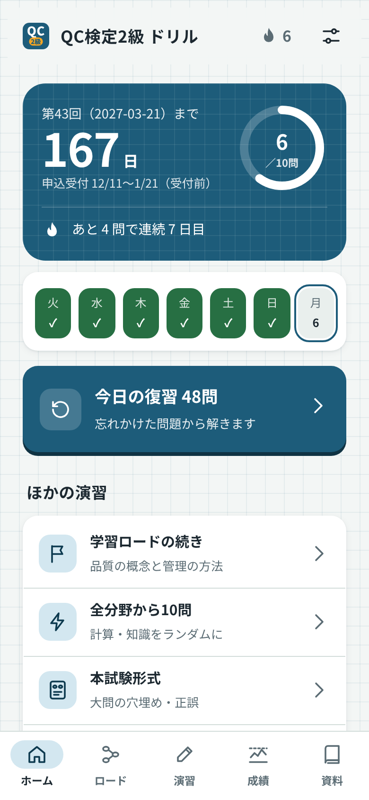
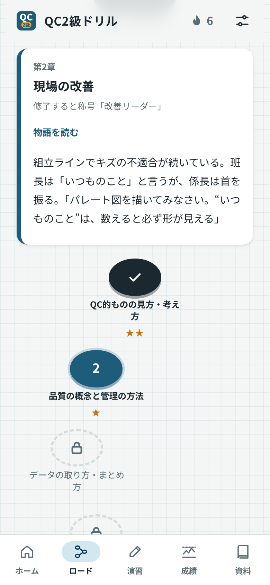
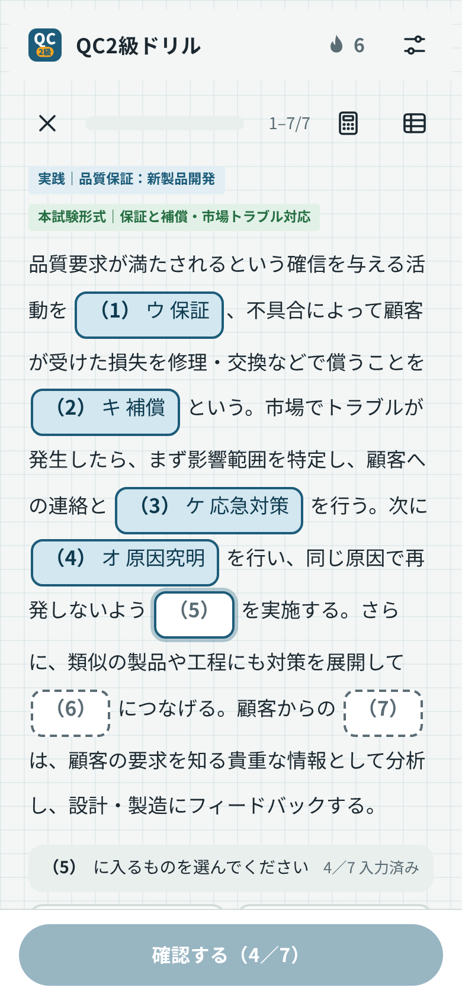
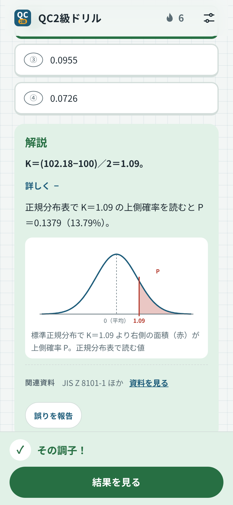

# QC2級ドリル

品質管理検定（QC検定）2級の「手法」と「実践」を、スマートフォンで毎日少しずつ学べる学習アプリです。ブラウザで使う Web 版と、Android アプリ版があります。無料で、広告もありません。

**[▶ Web 版を開く](https://kotaooka.github.io/qc2-drill/)**　｜　**[⬇ Android アプリ（APK）をダウンロード](https://github.com/kotaooka/qc2-drill/releases/latest)**

## 特長

- **初歩から合格水準まで順に進める「学習ロード」**　4級の基本から2級の総仕上げまで、8つの章・26のステージを物語仕立てで進めます。分かっている章は「飛び級テスト」で先に進めます。
- **本番と同じ形式で練習**　本試験形式の大問（空欄の穴埋め・正誤）、約100問・90分の模擬試験（本番と同じく大問だけで構成）、合格基準（各分野 概ね50%以上、総合 概ね70%以上）での判定。
- **計算問題は毎回数値が変わる**　検定・推定、管理図、工程能力、実験計画、回帰、抜取検査、信頼性など64種。解答中に電卓と数値表（正規分布・t・χ²・F・管理図係数・符号検定）を開けます。
- **忘れたころに出し直す復習**　正解するたびに次の出題までの間隔を延ばし（1日→3日→7日→…）、間違えた問題はその日の復習に戻します。
- **毎日続けやすい**　1日の目標問題数、連続記録、Android 版では毎日のリマインダー通知。
- **解説に図**　正規分布の面積、管理図、OC 曲線、バスタブ曲線などを、問題に合わせて表示します。
- **公式集と「あとで見る」**　計算でよく使う公式を分野別に一覧。気になる問題は「あとで見る」に登録して、まとめて解き直せます。

## はじめかた

### Web 版（パソコン・iPhone・Android）

1. [https://kotaooka.github.io/qc2-drill/](https://kotaooka.github.io/qc2-drill/) を開きます。
2. 初回だけ、試験日・1日の目標・文字サイズを選ぶ案内が出ます。
3. ホーム画面に追加すると、アプリのように起動できます。
   - Android（Chrome）：設定（右上）→「ホーム画面に追加」、またはブラウザのメニューの「アプリをインストール」
   - iPhone（Safari）：共有ボタン →「ホーム画面に追加」

一度開いたあとは、通信がなくても起動して解けます。解答記録はブラウザの中に保存されます。

### Android アプリ版

1. Android で [Releases の最新版](https://github.com/kotaooka/qc2-drill/releases/latest) を開き、「Assets」の **qc2-drill.apk** をタップしてダウンロードします。
2. ダウンロードしたファイルを開き、「インストール」をタップします。
   - 「提供元不明のアプリ」の確認が出たら、ダウンロードに使ったアプリ（Chrome など）にインストールを許可してください。Google Play を経由しないアプリのため、初回だけ必要です。
3. ホーム画面の「QC検定2級」から起動します。
4. 毎日の通知を使う場合は、設定（右上）→「毎日のリマインダー」をオンにし、通知を許可します。

**更新するとき**：新しい版の qc2-drill.apk を同じ手順で入れると、上書きインストールされます。解答記録は引き継がれます。

> APK は、このリポジトリの Releases から入手したものだけをインストールしてください。

## 使い方

| 画面 | できること |
|---|---|
| ホーム | 試験日までの日数と今日の目標。いちばん大きなボタンで「今日の復習」か「学習ロードの続き」を始めます |
| ロード | 章ごとのステージ。10問のレッスンを7割以上で2回クリアすると次へ。章末テスト（8割以上）で次の章へ |
| 演習 | 分野・問題の種類（計算／知識／本試験形式）を選んで演習。模擬試験（約100問・90分）もここから |
| 成績 | 総合・手法・実践の正答率、復習の予定、分野別の正答率、記録の書き出し・読み込み |
| 資料 | 公式レベル表との対応表（項目ごとの問題数と演習）、公式ページへのリンク、公式集、数値表 |

- 問題は、選択肢を選んでから「確認する」で採点します。本試験形式の大問は、本文の空欄をすべて埋めてからまとめて採点します。
- 解答中は、上部のボタンで電卓と数値表を開けます。数値表は問題に合う表で開き、解答後は使ったマスを強調します。
- 通常の演習は、途中でやめると進み具合がリセットされます（解答済みの正誤は記録に残ります）。模擬試験だけは途中で閉じても、ホームの「続きから再開」で戻れます。
- 解説の下の「☆ あとで見る」で問題を登録すると、ホームの「あとで見る」からまとめて解けます。
- 問題や解説の誤りに気づいたら、解説の下の「誤りを報告」から知らせてください。「GitHub で報告」を押すと、問題の内容を書き込んだ報告ページ（Issue）が開きます（GitHub のアカウントが必要）。
- 設定（右上）：テーマ（ライト／ダーク）、文字サイズ、効果音、バイブレーション、1日の目標、試験日・申込締切、通知、更新の確認。

## 収録内容

| 種類 | 数 |
|---|---|
| 知識問題 | 430問（手法9分野・実践7分野） |
| 計算問題 | 64種（出題のたびに数値が変わる） |
| 本試験形式の大問 | 46題・291問（計算が連鎖する複合大問、実践の事例問題を含む） |
| 学習ロード | 8章・26ステージ |

出題範囲は、日本規格協会「品質管理検定レベル表（Ver.20150130.2）」の2級欄の全103項目に対応させています。2級の範囲に含まれる3級・4級の項目（61項目）も含め、全164項目それぞれに3問以上あります。

計算問題の正解は、数値計算ライブラリ（scipy）で独立に計算し直して照合しています。

## よくある質問

**解答記録はどこに保存されますか？**
使っている端末の中（Web 版はブラウザ、アプリ版はアプリ内）だけです。サーバーには送信しません。

**機種変更やブラウザを変えるときは？**
成績タブの「書き出す」で記録をテキストにして控え、新しい端末の「読み込む」に貼り付けると引き継げます。アプリ版と Web 版の間でも移せます。

**iPhone で使えますか？**
Web 版が使えます。通知とバイブレーションは使えません。

**問題や解説に誤りを見つけたら？**
解説の下の「誤りを報告」でメモを残せます（成績タブで一覧・コピーできます）。[Issues](https://github.com/kotaooka/qc2-drill/issues) に書き込んでいただければ修正します。

**通知が届きません。**
Android の設定 → アプリ →「QC検定2級」→ 通知 が許可されているか確認してください。電池の最適化の影響で、数分遅れて届くことがあります。その日の目標を達成済みの日は通知しません。

## 注意事項

- 本アプリは個人が作成した**非公式**の学習教材です。日本規格協会・日本科学技術連盟とは関係ありません。
- 「QC検定」は一般財団法人日本規格協会の登録商標です。
- 問題と解説はすべてオリジナルで、過去の試験問題は使用していません。過去問題は日本規格協会の過去問題集をご利用ください。
- 内容の正確さには注意していますが、誤りが含まれる可能性があります。規格の条項などは最新の原文で確認してください。
- 試験日と申込締切は、設定で自分で入れます。日程は[日本規格協会の試験日程のページ](https://webdesk.jsa.or.jp/common/W10K0500/index/qc/qc_next_kentei)で確認してください。

## 開発者向け

ビルド・テスト・問題の追加方法・リリース手順は [DEVELOPMENT.md](DEVELOPMENT.md) を参照してください。

## ライセンス

[MIT License](LICENSE)
